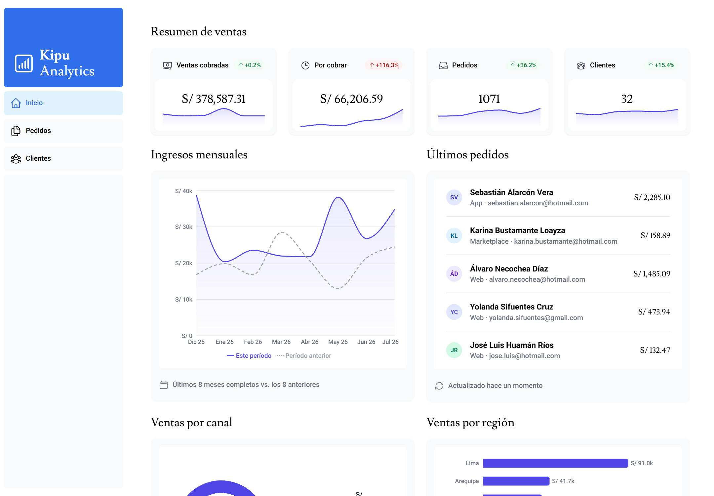
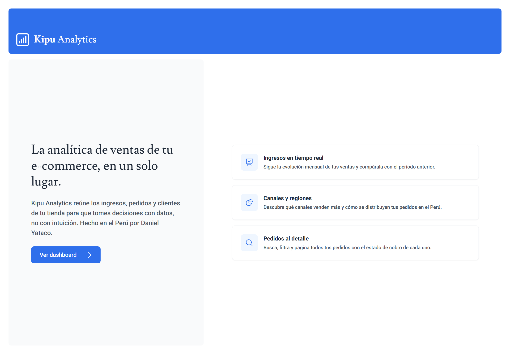
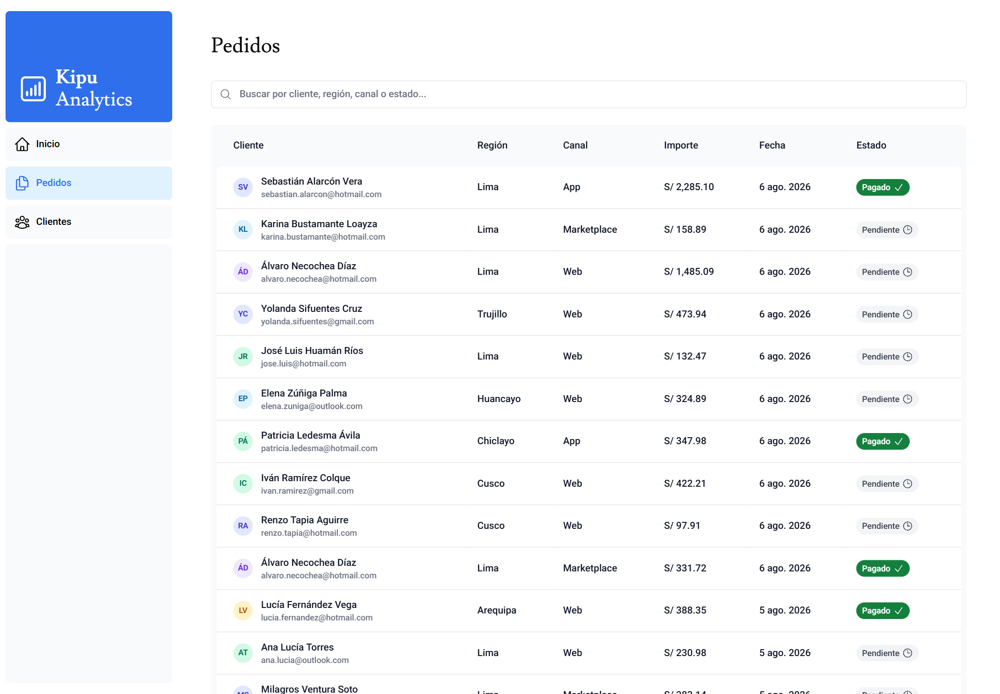
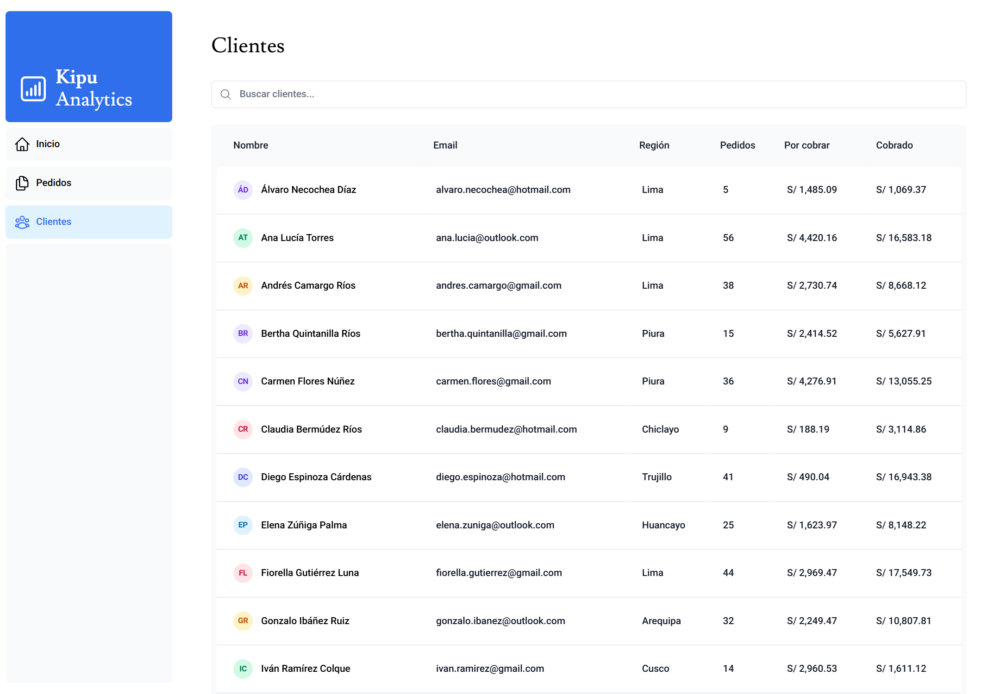
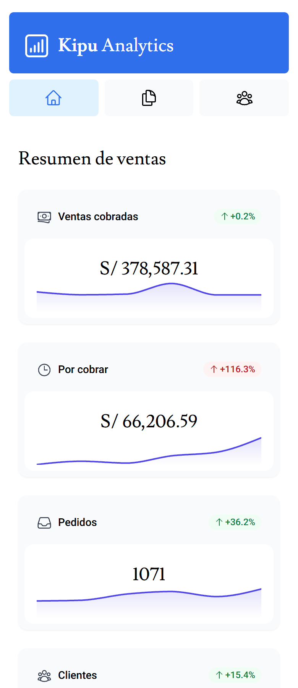
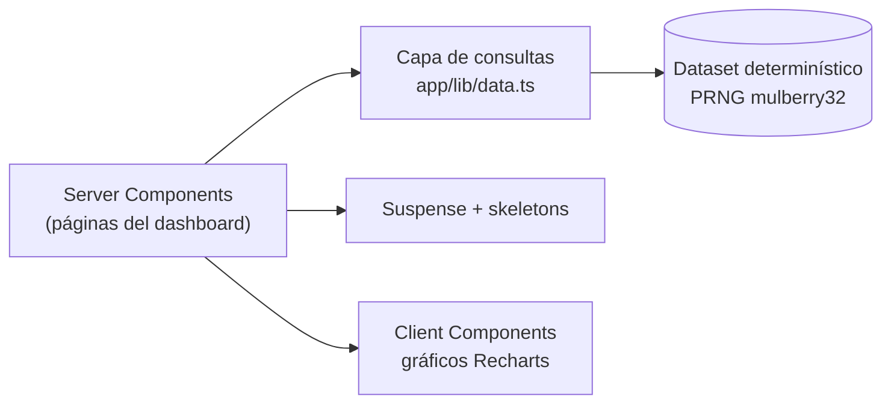

# Kipu Analytics — Dashboard de ventas e-commerce para Perú

<p align="center">
  
</p>

<p align="center">
  
  
  
  
  
  
</p>

Dashboard de analítica de ventas para un e-commerce peruano, construido con el **App Router de Next.js**: Server Components, streaming con `Suspense`, búsqueda y paginación sincronizadas con la URL, y visualizaciones con Recharts. Todos los importes en **soles (S/)** y datos regionales del Perú.

> **Funciona al clonar**: no necesita base de datos ni variables de entorno. El dataset es determinístico y se genera en memoria con un PRNG de semilla fija, así que los números son idénticos en cada ejecución.

## Funcionalidades

- **4 tarjetas KPI** (ventas cobradas, por cobrar, pedidos, clientes) con **sparkline** de los últimos 6 meses y variación porcentual real frente al mes anterior.
- **Gráfico de ingresos mensuales** comparando el período actual con el anterior punto por punto (línea punteada).
- **Ventas por canal** (Web / App / Marketplace) en donut y **ventas por región** en barras horizontales.
- **Búsqueda con debounce** y **paginación** en la tabla de pedidos, ambas sincronizadas con `searchParams` (compartible por URL).
- **Streaming con Suspense**: cada sección carga con su propio skeleton, sin bloquear la página.
- Avatares generados con iniciales (sin imágenes externas), estados `loading`, `error` y `not-found` por segmento.
- Formato `es-PE` para moneda y fechas.

## Interfaces

| Landing | Pedidos (búsqueda + paginación) |
|---|---|
|  |  |

| Clientes | Vista móvil |
|---|---|
|  |  |

## Arquitectura



**Decisiones de diseño:**

- **Sin base de datos.** La capa de consultas (`fetchRevenue`, `fetchCardData`, `fetchFilteredInvoices`…) mantiene una interfaz asíncrona con latencia simulada, así que sustituirla por Postgres o cualquier API sería cambiar solo ese módulo. Para un portafolio, que el proyecto **funcione al clonar** vale más que la pureza arquitectónica.
- **Datos con forma realista.** El generador aplica tendencia mensual al alza, estacionalidad (picos en julio por Fiestas Patrias y en diciembre por Navidad), una curva de cobranza que decae suavemente con la antigüedad del pedido, y adquisición progresiva de clientes.
- **Un solo lenguaje visual para los gráficos**: paleta, ejes y tooltips centralizados en `app/ui/charts/theme.ts`, de modo que los seis gráficos se lean como un sistema y no como piezas sueltas.

## Ejecución local

```bash
git clone https://github.com/danielyatacoblas/dashboard-analytic.git
cd dashboard-analytic
pnpm install     # o npm install
pnpm dev         # http://localhost:3000
```

Sin `.env`, sin base de datos, sin servicios externos.

## Stack

| Capa | Tecnología |
|---|---|
| Framework | Next.js 15 (App Router, Server Components) + React 19 |
| Lenguaje | TypeScript (strict) |
| Estilos | Tailwind CSS + @tailwindcss/forms |
| Gráficos | Recharts |
| Iconos | Heroicons |
| Fuentes | next/font (Lusitana + Roboto) |

## Autor

**Daniel Yataco Blas** — [GitHub](https://github.com/danielyatacoblas)

## Licencia

Proyecto de portafolio bajo **licencia propietaria**: el código puede verse con fines de evaluación profesional, pero no copiarse, redistribuirse ni reutilizarse sin autorización escrita. Ver [LICENSE](LICENSE).
